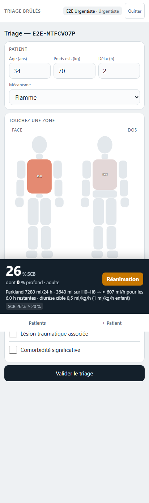
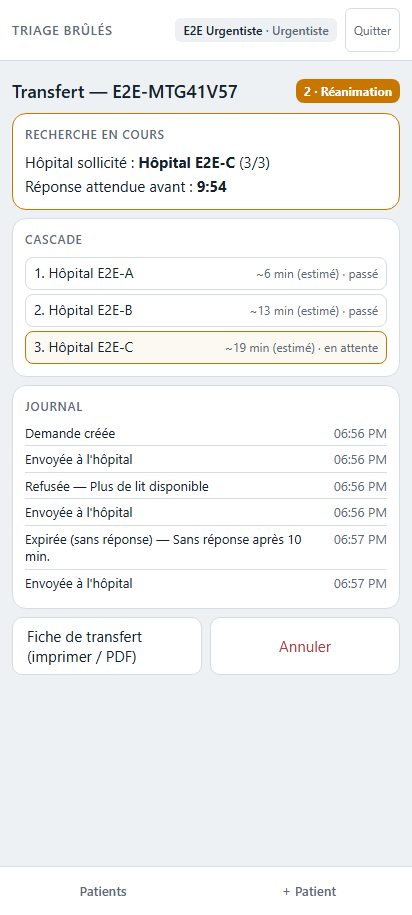
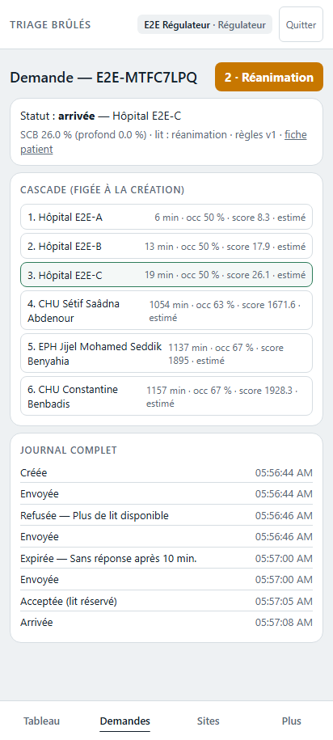

# BurnFlow 🔥🏥

**Triage et orientation des brûlés en afflux massif** — carte corporelle
Lund-Browder, routage de proche en proche avec équilibrage de charge entre
hôpitaux, télé-avis de brûlologue, notifications push. Pensé pour être
déployé en quelques heures quand un incendie massif sature les centres
des brûlés.

[](https://github.com/louniskhodjama-tech/burnflow/actions/workflows/ci.yml)
[](LICENSE)


> **English summary** — BurnFlow is an open-source mass-casualty burn triage
> and patient-routing platform: Lund-Browder body map with ISBI severity
> criteria, load-balanced hospital cascade routing (refusal/timeout →
> automatic fallback with bed reservation), national burn-specialist advice
> queue, web push notifications, full audit trail. French UI, built for the
> Algerian health system, reusable anywhere. Self-hosted: Next.js 15 +
> PostgreSQL 16 + optional OSRM routing + optional Anthropic AI assists
> (bring your own API key — the app is fully functional without it).

| Triage carte corporelle | Cascade avec bascule automatique | Journal du régulateur |
|---|---|---|
|  |  |  |

## Le problème

Lors d'incendies massifs, les centres des brûlés saturent en quelques
heures, des hôpitaux régionaux sont hors service, et le régulateur n'a
aucune vue unifiée des lits disponibles. Les patients sont évacués « au
jugé », parfois vers des services déjà pleins, pendant que des lits
adaptés restent libres ailleurs.

## La réponse

BurnFlow relie le terrain, les hôpitaux et la régulation en temps réel.
**Objectif clinique : décharger les centres des brûlés** en orientant vers
la chirurgie et la réanimation tout ce qui peut l'être selon les critères
ISBI — et en réservant les centres aux patients qui en relèvent vraiment.

### Quatre rôles, strictement cloisonnés

- **Urgentiste** (point médical de triage) : patient pseudonymisé (ID
  bracelet uniquement — jamais de nom, téléphone ni photo), carte
  corporelle face/dos par tranche d'âge Lund-Browder, SCB et Parkland
  calculés en direct, classe d'orientation (chirurgie / réanimation /
  centre des brûlés), demande de transfert en un geste, demande d'avis.
- **Référent hôpital** : capacité en 6 champs (gros boutons ±,
  « Confirmer inchangé »), demandes reçues avec compte à rebours,
  accepter (= **lit réservé** transactionnellement) ou refuser avec motif,
  patients attendus, arrivée.
- **Régulateur** : tableau de bord national (attentes par classe,
  occupation et fraîcheur des capacités, carte), cascade de chaque demande
  avec scores, forçage motivé, gestion des sites (vérification avant
  activation), des comptes et des codes d'accès, seuils cliniques
  **versionnés**, rapport de situation 6 h, export CSV du journal d'audit.
- **Brûlologue consultant** : file nationale « premier qui prend »
  (verrou exclusif), fiche clinique pseudonymisée, réponse visible
  immédiatement par l'urgentiste, retour automatique en file après délai.

### Le routage, en une formule

Les hôpitaux candidats (actifs, capacité fraîche < 6 h, lit du bon type)
sont classés par `score = minutes_de_trajet × (1 + λ·occupation²)` —
proche mais saturé perd contre plus loin mais disponible. Un hôpital à
occupation ≥ 85 % passe en fin de cascade. La demande part au premier ;
refus motivé ou silence (10 min) → bascule automatique au suivant, jusqu'à
acceptation — qui **décrémente le lit** (deux demandes ne peuvent pas
obtenir le dernier lit). Cascade épuisée → alerte régulateur. Distances via
OSRM auto-hébergé, avec estimation haversine de secours si OSRM est
indisponible. Tous les seuils (λ, saturation, délais, mode « centres
protégés ») sont réglables par le régulateur, chaque version étant tracée.

### Assistances IA — optionnelles, suggestives, jamais décisionnelles

Trois aides propulsées par l'API Anthropic (`claude-sonnet-4-6`) :
contrôle de cohérence à la validation du triage, fiche de transfert
rédigée, synthèse pour l'avis brûlologue. **Chacun apporte sa propre clé**
(`ANTHROPIC_API_KEY` dans `.env.local`) ; sans clé, tout fonctionne — ces
aides restent simplement muettes (*fail-open*, y compris en cas de panne
de l'API). L'agent ne reçoit que le bilan structuré pseudonymisé de la
tâche en cours — jamais d'identité (il n'y en a pas en base), jamais les
capacités ni le journal. Prompts lisibles dans
[`src/lib/agent/prompts/`](src/lib/agent/prompts/).

## Démarrage rapide

Prérequis : Node ≥ 20, pnpm ≥ 9, Docker.

```bash
git clone https://github.com/louniskhodjama-tech/burnflow.git
cd burnflow
docker compose up -d postgres mailpit   # Postgres :5433 · Mailpit UI :8025
pnpm install
cp .env.example .env.local              # compléter (voir tableau ci-dessous)
pnpm db:migrate
pnpm seed:demo                          # 10 sites + 1 compte par rôle + codes d'accès affichés
pnpm dev                                # http://localhost:3000
```

Connectez-vous avec l'un des codes affichés par `seed:demo`
(authentification par codes personnels — durables, prolongeables,
révocables par le régulateur ; `pnpm gen:code <email> [n] [jours]` en
secours).

### Configuration (`.env.local`)

| Variable | Rôle | Obligatoire |
|---|---|---|
| `DATABASE_URL` | PostgreSQL 16 | oui |
| `APP_URL` | URL publique | oui |
| `SESSION_SECRET` | ≥ 32 caractères aléatoires | oui |
| `ANTHROPIC_API_KEY` | **votre** clé API pour les aides IA | non — tout fonctionne sans |
| `SMTP_*` | emails de notification (dev : Mailpit) | non |
| `VAPID_*` | notifications push (`npx web-push generate-vapid-keys`) | non |
| `OSRM_URL` | temps de trajet routiers (sinon : estimation) | non |

### Tests

```bash
pnpm test        # unitaires : scoring clinique, routage, matrice des rôles
pnpm test:e2e    # scénario complet Playwright contre un build de production
```

Le scénario E2E rejoue l'histoire entière : création → triage classe 2 →
cascade → refus → expiration (vrai job cron) → acceptation avec lit
réservé → avis pris et répondu → arrivée → journal complet
([rapport et captures](docs/E2E-REPORT.md)).

### OSRM (optionnel mais recommandé en production)

```bash
bash scripts/osrm-prepare.sh            # télécharge l'extrait routier et le prépare
docker compose up -d osrm
pnpm distances:rebuild --only-estimates # remplace les estimations par du vrai routier
```

Le script utilise l'extrait Algérie de Geofabrik — adaptez l'URL à votre
région dans `scripts/osrm-prepare.sh`.

## Application installable (PWA)

Installable sur ordinateur et mobile (HTTPS requis) : plein écran, icône,
raccourcis (nouveau patient, capacité, file des avis, régulation) et
notifications push cliquables qui ouvrent l'écran concerné, même
téléphone en veille.

## Déploiement

Un `docker-compose.yml` complet (app + PostgreSQL + OSRM) et un
`Dockerfile` multi-étages sont fournis ; les migrations s'appliquent au
démarrage (`RUN_MIGRATIONS_ON_BOOT=1`). Fonctionne aussi sur les plateformes
d'hébergement d'applications (PaaS) avec PostgreSQL managé — c'est ainsi que
tourne l'instance de référence (PivoCloud, données en Algérie).

**Mise en production d'une base vide, en trois commandes** (depuis un poste
disposant du dépôt, `<prod>` étant l'URL de la base de production) :

```bash
# 1. Migrations + configuration clinique v1 + premier RÉGULATEUR admin
#    (son code d'accès personnel s'affiche une seule fois)
DATABASE_URL=<prod> pnpm tsx scripts/bootstrap-prod.ts <email> <Nom Affiché>

# 2. Import des hôpitaux (inactifs, « à vérifier » — le régulateur les
#    valide puis les active dans l'interface, écran Sites)
DATABASE_URL=<prod> pnpm tsx scripts/seed-sites.ts data/sites.east-draft.csv

# 3. (facultatif) codes d'accès supplémentaires pour un compte existant
DATABASE_URL=<prod> pnpm tsx scripts/gen-code.ts <email> [nombre] [jours]
```

Adaptez le CSV à votre région à partir de `data/sites.template.csv`. Guide pas à pas (Dokploy ou tout hôte Docker), sauvegardes
quotidiennes et conduite d'incident : [docs/RUNBOOK.md](docs/RUNBOOK.md).
Cahier des charges d'origine : [docs/GOAL.md](docs/GOAL.md) · décisions
d'architecture : [docs/DECISIONS.md](docs/DECISIONS.md) · matrice des
rôles testée : [docs/ROLES.md](docs/ROLES.md).

## ⚠️ Avertissement médical

BurnFlow est un **outil d'aide à la décision et à la coordination**. Il ne
constitue pas un dispositif médical, ne pose aucun diagnostic et ne
remplace en aucun cas le jugement clinique. Les seuils livrés par défaut
(critères ISBI) doivent être **revus et validés par l'autorité médicale de
chaque déploiement** avant toute utilisation réelle. Aucune donnée
nominative patient ne doit être saisie dans l'application.

## Crédits et licence

Grille clinique de triage (table Lund-Browder par âge, signes de gravité
ISBI, classes d'orientation, Parkland) conçue et validée par le
**Dr Lounis Khodja Mounir Abderrahmane**.

Code sous licence [Apache 2.0](LICENSE) — utilisez, adaptez, déployez,
avec attribution. Les contributions (issues, PR, retours de terrain,
traductions) sont bienvenues : voir [CONTRIBUTING.md](CONTRIBUTING.md) ·
vulnérabilités : [SECURITY.md](SECURITY.md).
